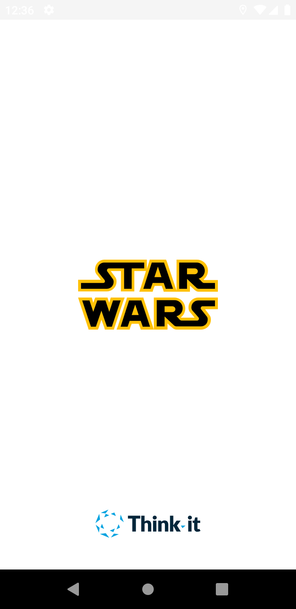
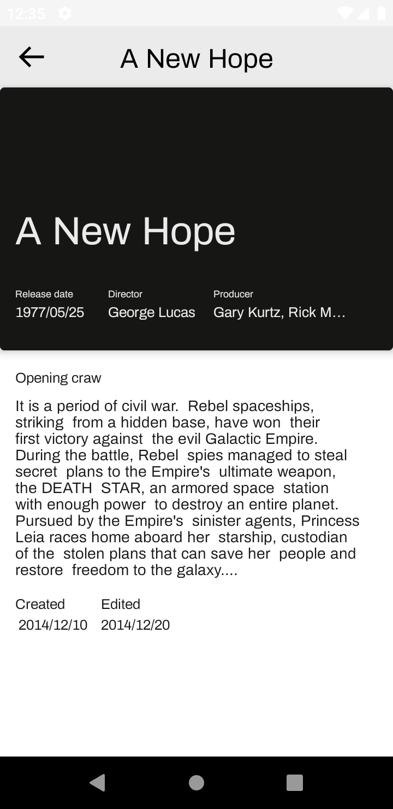
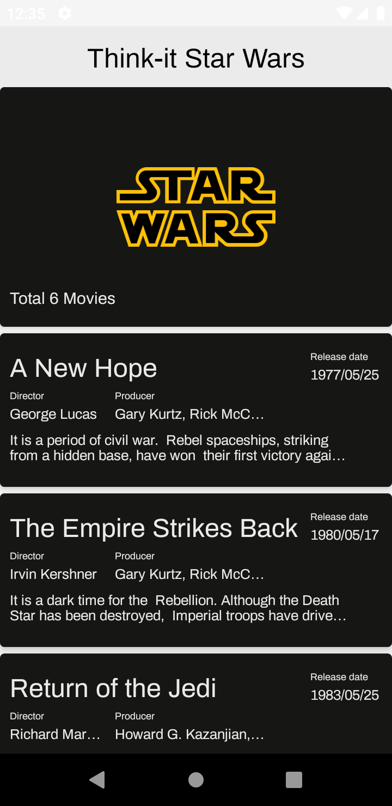

# StarWars

This project contain :
* MVVM with clean architecture implementation base on [Android architecture Guide](https://developer.android.com/jetpack/docs/guide) and [Uncle Bob clean Architecture](https://blog.cleancoder.com/uncle-bob/2012/08/13/the-clean-architecture.html) 
* StarWars movies data from [Swapi public API](https://swapi.dev/)

# Project Structure
Onion architecture with 3 layers: 
* Domain : project core contain business logic
* Data : managing app data
* Presentation : present data to the user and handel user interaction 

Used Libs
---------------
* [Material](https://material.io/develop/android/docs/getting-started/) 
* [ViewBinding](https://developer.android.com/topic/libraries/view-binding/)
* [ViewModel](https://developer.android.com/topic/libraries/architecture/viewmodel)
* [LiveData](https://developer.android.com/jetpack/arch/livedata)
* [Coroutines](https://github.com/Kotlin/kotlinx.coroutines#user-content-android)
* [Flows](https://kotlin.github.io/kotlinx.coroutines/kotlinx-coroutines-core/kotlinx.coroutines.flow/-flow/)
* [Dagger](https://dagger.dev/) 
* [Moshi](https://github.com/square/moshi) 
* [Retrofit2](https://square.github.io/retrofit/) 
* [mockwebserver](https://github.com/square/okhttp/tree/master/mockwebserver) 
* [googleTruth](https://truth.dev/) 

Screenshots
---------------

